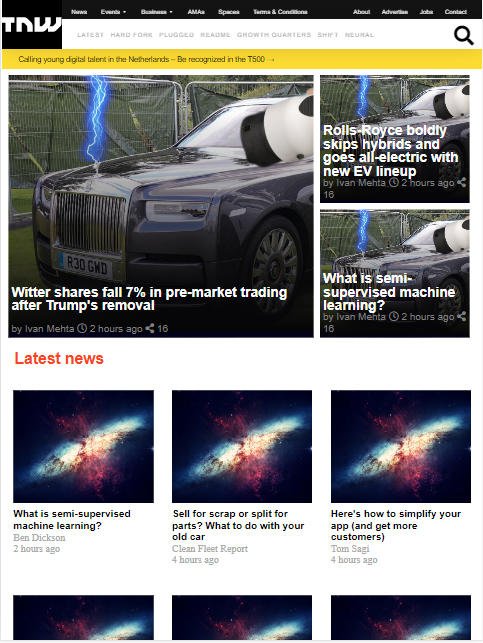

# TNW Responsive desing project

> This is a complete proyect of a replica of TheNextWeb index page, using CSS and HTML

> 

> 

> 

> -FlexBox
> -Floats
> -Grid
> -Gradients

## Built With

- HTML & CSS

## Live Demo

[Live Demo Link](https://notrexxx.github.io/TNW-RESPONSIVE-HTML-CSS/)

## Authors

👤 **Author1**

- GitHub: [@notrexxx](https://github.com/notrexxx)
- Twitter: [@emigdioleon1](https://twitter.com/emigdioleon1)
- LinkedIn: [Emigdio Leon](https://linkedin.com/emigdio-leon-689109195)

👤 **Author2**

- GitHub: [@eroauditore](https://github.com/eroauditore)
- LinkedIn: [Eduardo](https://linkedin.com/eroauditore)

## 🤝 Contributing

Contributions, issues, and feature requests are welcome!

Feel free to check the [issues page](issues/).

## Show your support

Give a ⭐️ if you like this project!

## Acknowledgments

The Stand Up Team

## 📝 License

This project is [MIT](./LICENSE) licensed.
